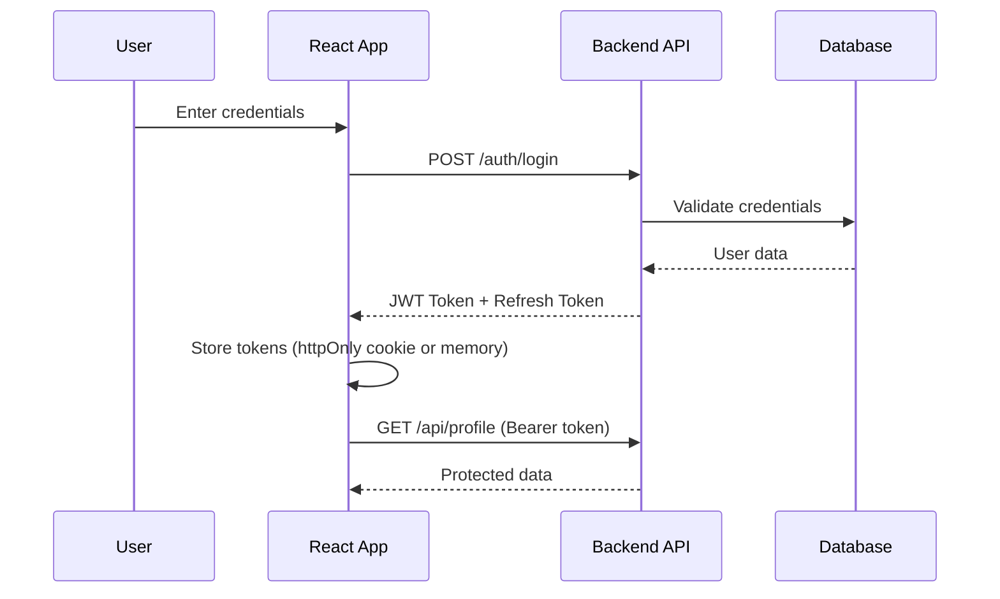

# Authentication Patterns: Securing Your React App

Authentication is the gateway to your application. Get it wrong, and you expose user data. Get it right, and your users trust you.

This chapter covers **JWT-based authentication**, **protected routes**, and **OAuth integration**.

---

## The Authentication Flow



---

## JWT Basics

A **JSON Web Token** has three parts:
1. **Header**: Algorithm & token type
2. **Payload**: User data (claims)
3. **Signature**: Verification hash

```
eyJhbGciOiJIUzI1NiIsInR5cCI6IkpXVCJ9.  // Header
eyJ1c2VySWQiOjEsInJvbGUiOiJhZG1pbiJ9.  // Payload
SflKxwRJSMeKKF2QT4fwpMeJf36POk6yJV_adQssw5c  // Signature
```

::: {.callout-warning}
**Never store JWTs in localStorage!** It's vulnerable to XSS attacks. Use httpOnly cookies or in-memory storage with refresh tokens.
:::

---

## Building an Auth Context

Create a central authentication state that's accessible throughout your app:

```tsx
import { createContext, useContext, useState, useEffect } from 'react';

type User = { id: string; email: string; role: string } | null;

type AuthContextType = {
  user: User;
  login: (email: string, password: string) => Promise<void>;
  logout: () => void;
  isLoading: boolean;
};

const AuthContext = createContext<AuthContextType | undefined>(undefined);

export function AuthProvider({ children }: { children: React.ReactNode }) {
  const [user, setUser] = useState<User>(null);
  const [isLoading, setIsLoading] = useState(true);

  // Check for existing session on mount
  useEffect(() => {
    checkAuth();
  }, []);

  async function checkAuth() {
    try {
      const res = await fetch('/api/auth/me', { credentials: 'include' });
      if (res.ok) {
        setUser(await res.json());
      }
    } finally {
      setIsLoading(false);
    }
  }

  async function login(email: string, password: string) {
    const res = await fetch('/api/auth/login', {
      method: 'POST',
      headers: { 'Content-Type': 'application/json' },
      body: JSON.stringify({ email, password }),
      credentials: 'include', // Important for cookies!
    });

    if (!res.ok) throw new Error('Invalid credentials');
    setUser(await res.json());
  }

  function logout() {
    fetch('/api/auth/logout', { method: 'POST', credentials: 'include' });
    setUser(null);
  }

  return (
    <AuthContext.Provider value={{ user, login, logout, isLoading }}>
      {children}
    </AuthContext.Provider>
  );
}

export function useAuth() {
  const context = useContext(AuthContext);
  if (!context) throw new Error('useAuth must be used within AuthProvider');
  return context;
}
```

---

## Protected Routes

Wrap routes that require authentication:

```tsx
import { Navigate, Outlet } from 'react-router-dom';
import { useAuth } from './AuthContext';

function ProtectedRoute() {
  const { user, isLoading } = useAuth();

  if (isLoading) {
    return <div>Loading...</div>; // Or a spinner
  }

  if (!user) {
    return <Navigate to="/login" replace />;
  }

  return <Outlet />;
}

// Usage in router:
<Routes>
  <Route path="/login" element={<LoginPage />} />
  
  <Route element={<ProtectedRoute />}>
    <Route path="/dashboard" element={<Dashboard />} />
    <Route path="/settings" element={<Settings />} />
  </Route>
</Routes>
```

---

## Role-Based Access Control (RBAC)

Extend the protected route pattern to check roles:

```tsx
function RequireRole({ allowedRoles, children }: { 
  allowedRoles: string[]; 
  children: React.ReactNode 
}) {
  const { user } = useAuth();

  if (!user || !allowedRoles.includes(user.role)) {
    return <Navigate to="/unauthorized" replace />;
  }

  return <>{children}</>;
}

// Usage:
<RequireRole allowedRoles={['admin', 'moderator']}>
  <AdminPanel />
</RequireRole>
```

---

## OAuth / Social Login

For Google, GitHub, etc., the flow is:

1. User clicks "Login with Google"
2. Redirect to Google's OAuth page
3. Google redirects back with an authorization code
4. Your backend exchanges the code for tokens
5. Backend creates/finds user, returns your JWT

```tsx
function SocialLoginButtons() {
  const handleGoogleLogin = () => {
    // Redirect to your backend's OAuth initiation endpoint
    window.location.href = '/api/auth/google';
  };

  return (
    <button onClick={handleGoogleLogin}>
      <GoogleIcon /> Continue with Google
    </button>
  );
}
```

---

## Security Checklist

- [ ] Use `httpOnly` cookies for token storage
- [ ] Implement refresh token rotation
- [ ] Set short expiration times for access tokens (15-30 min)
- [ ] Validate tokens on the server, not just the client
- [ ] Use HTTPS everywhere
- [ ] Implement rate limiting on auth endpoints
- [ ] Log authentication events for auditing

Authentication is not just a feature—it's a responsibility.
