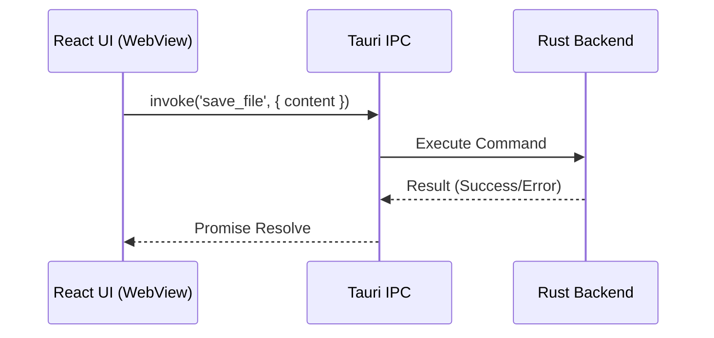

# Cross-Platform Desktop Apps: React on the Desktop

For years, **Electron** was the king of building desktop apps with web technologies. But it had a heavy cost: it bundled an entire Chrome browser and Node.js runtime with *every single app*.

Enter **Tauri**.

Tauri allows you to build tiny, blazing-fast binaries for macOS, Windows, and Linux by using the OS's native webview (WebKit on macOS, WebView2 on Windows) and a Rust backend.

And the best part? **The UI is just a standard React app.**

---

## Architecture: The Rust Sandwich

Think of a Tauri app as a sandwich:

1.  **Top Bun (Frontend)**: Your React + Vite app (`ui/`). It talks to the system via an "IPC Bridge".
2.  **Meat (Backend)**: The Rust Core (`src-tauri/`). It handles file system access, window management, and heavy computation.
3.  **Bottom Bun (OS)**: The native operating system.



---

## Setting up React in Tauri

If you followed our Monorepo architecture, your `apps/desktop` folder looks like this:

```
apps/desktop/
├── src-tauri/      <-- The Rust "Shell"
│   ├── src/main.rs
│   └── tauri.conf.json
└── ui/             <-- Your React App (standard Vite)
    ├── src/
    └── vite.config.ts
```

**`tauri.conf.json`** tells Tauri where to look for your React app:

```json
{
  "build": {
    "beforeDevCommand": "npm run dev",
    "beforeBuildCommand": "npm run build",
    "devPath": "http://localhost:1420",
    "distDir": "../ui/dist"
  }
}
```

---

## Calling Rust from React

This is where the magic happens. You expose a Rust function as a "Command", and call it from React like an async function.

**1. Rust Side (`main.rs`)**:
```rust
#[tauri::command]
fn greet(name: &str) -> String {
    format!("Hello, {}! You've been greeted from Rust!", name)
}

fn main() {
    tauri::Builder::default()
        .invoke_handler(tauri::generate_handler![greet])
        .run(tauri::generate_context!())
        .expect("error while running tauri application");
}
```

**2. React Side (`App.tsx`)**:
```tsx
import { invoke } from '@tauri-apps/api/tauri';
import { useState } from 'react';

function App() {
  const [msg, setMsg] = useState("");

  async function callRust() {
    // This looks like an API call, but it goes directly to the Rust binary!
    const response = await invoke('greet', { name: 'React Developer' });
    setMsg(response as string);
  }

  return (
    <button onClick={callRust}>Call Native Backend</button>
  );
}
```

---

## Why React Developers Love Tauri

1.  **Tiny Bundle Size**: A Hello World app is ~3MB (vs 100MB+ for Electron).
2.  **Security**: No Node.js in the UI thread. The UI is sandboxed.
3.  **Performance**: Offload heavy logic (image processing, encryption) to Rust, keep the UI thread buttery smooth.

You are no longer "just" a web developer. With React + Tauri, you are a **Native App Developer**.
