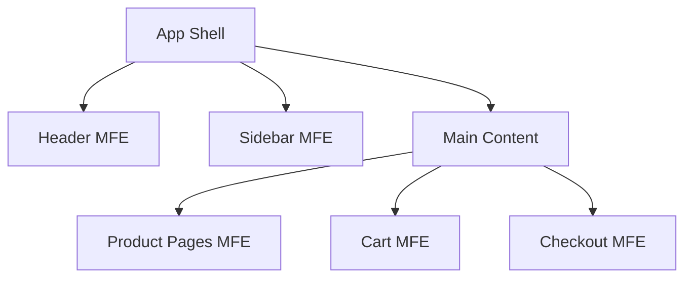

# Enterprise React Patterns: Scaling to Large Teams

Building a side project is different from building a product that 50 engineers work on. **Enterprise patterns** help teams move fast without breaking things.

This chapter covers **feature flags**, **microfrontends**, **module federation**, and conventions for large codebases.

---

## The Challenges of Scale

- **Team coordination**: How do 10 teams ship to the same codebase?
- **Build times**: CI takes 45 minutes. Developers are blocked.
- **Feature rollout**: How to test in production without breaking users?
- **Code ownership**: Who owns what? How to prevent regressions?

---

## Feature Flags: Deploy != Release

Feature flags decouple **deployment** (code goes to production) from **release** (users see it).

### Simple Implementation

```tsx
// featureFlags.ts
type FeatureFlags = {
  newCheckout: boolean;
  darkMode: boolean;
  aiAssistant: boolean;
};

const flags: FeatureFlags = {
  newCheckout: process.env.ENABLE_NEW_CHECKOUT === 'true',
  darkMode: true,
  aiAssistant: false,
};

export function useFeatureFlag<K extends keyof FeatureFlags>(key: K): boolean {
  return flags[key];
}
```

### Usage

```tsx
function CheckoutPage() {
  const useNewCheckout = useFeatureFlag('newCheckout');

  return useNewCheckout ? <NewCheckout /> : <LegacyCheckout />;
}
```

### Production-Grade Solutions

For real-world apps, use a flag service:

- **LaunchDarkly**: Industry leader, supports targeting
- **Unleash**: Open-source alternative
- **Flagsmith**: Full-featured OSS option
- **PostHog**: Flags + Analytics

```tsx
// With LaunchDarkly
import { useFlags } from 'launchdarkly-react-client-sdk';

function Dashboard() {
  const { newDashboard } = useFlags();
  
  return newDashboard ? <NewDashboard /> : <OldDashboard />;
}
```

---

## Microfrontends: Independent Deployments

When your monolith becomes too big, split it into independently deployable frontends.



### Module Federation (Webpack 5)

Share code between builds at runtime:

```js
// shell/webpack.config.js
const ModuleFederationPlugin = require('webpack/lib/container/ModuleFederationPlugin');

module.exports = {
  plugins: [
    new ModuleFederationPlugin({
      name: 'shell',
      remotes: {
        cart: 'cart@https://cart.example.com/remoteEntry.js',
        checkout: 'checkout@https://checkout.example.com/remoteEntry.js',
      },
      shared: ['react', 'react-dom'],
    }),
  ],
};
```

```tsx
// shell/src/App.tsx
const Cart = React.lazy(() => import('cart/CartWidget'));
const Checkout = React.lazy(() => import('checkout/CheckoutFlow'));

function App() {
  return (
    <Suspense fallback={<Spinner />}>
      <Cart />
      <Checkout />
    </Suspense>
  );
}
```

---

## Code Ownership & CODEOWNERS

Define who owns what in your repository:

```
# .github/CODEOWNERS
/src/features/checkout/   @checkout-team
/src/features/products/   @catalog-team
/src/shared/              @platform-team
/src/design-system/       @design-team
```

Now PRs require approval from the owning team.

---

## Monorepo Structure

For large orgs, a monorepo with clear boundaries works well:

```
my-company/
├── apps/
│   ├── web-app/           # Main React app
│   ├── admin-portal/      # Internal tools
│   └── mobile-app/        # React Native
├── packages/
│   ├── design-system/     # Shared components
│   ├── api-client/        # API abstraction
│   ├── analytics/         # Tracking utils
│   └── feature-flags/     # Flag utilities
├── tools/
│   ├── eslint-config/     # Shared ESLint rules
│   └── tsconfig/          # Shared TypeScript config
└── package.json
```

Use **Turborepo** or **Nx** to manage builds and caching.

---

## Architectural Decision Records (ADRs)

Document important decisions so future developers understand *why*:

```markdown
# ADR-007: Use Zustand over Redux for new features

## Status
Accepted

## Context
Redux requires significant boilerplate. New team members struggle.

## Decision
Use Zustand for all new feature state. Existing Redux remains.

## Consequences
- Easier onboarding
- Two state libraries in codebase (temporary)
```

Store in `/docs/adr/` and link from your README.

---

## CI/CD Best Practices

1. **Parallelize tests**: Run unit, integration, and e2e in parallel
2. **Cache dependencies**: Save minutes on every build
3. **Preview deployments**: Every PR gets a preview URL
4. **Canary releases**: Roll out to 1% of users first
5. **Automated rollback**: Detect errors, revert automatically

```yaml
# Example: Preview deployment
- name: Deploy Preview
  if: github.event_name == 'pull_request'
  run: |
    vercel deploy --prebuilt --token=${{ secrets.VERCEL_TOKEN }}
```

---

## Team Conventions

| Area | Convention |
|------|------------|
| **File naming** | `PascalCase.tsx` for components, `camelCase.ts` for utils |
| **Folder structure** | Feature-based (`/features/checkout/`) not type-based (`/components/`) |
| **Imports** | Absolute imports with path aliases (`@/features/checkout`) |
| **State** | Zustand for global, React state for local |
| **Testing** | Co-locate tests with source (`Button.test.tsx` next to `Button.tsx`) |

Document conventions and enforce with ESLint.

---

## Scaling Checklist

- [ ] Feature flags for safe rollouts
- [ ] CODEOWNERS for accountability
- [ ] ADRs for decision history
- [ ] Monorepo tooling (Nx/Turborepo)
- [ ] Preview deployments on every PR
- [ ] Shared design system package
- [ ] Consistent coding conventions (enforced)

Enterprise React isn't about complexity—it's about **sustainable velocity**.
