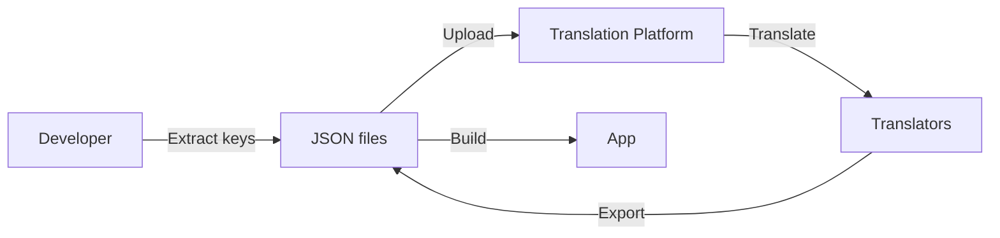

# Internationalization (i18n): Building Global-Ready Apps

If your app is only in English, you're missing 75% of the internet. **Internationalization** (i18n) prepares your app for multiple languages and locales.

This chapter covers **react-i18next**, date/number formatting, and right-to-left (RTL) support.

---

## i18n vs l10n

- **Internationalization (i18n)**: Architecture that supports multiple languages
- **Localization (l10n)**: Actual translation and adaptation for a specific locale

Think of i18n as building the plumbing; l10n is the water you run through it.

---

## Setting Up react-i18next

```bash
npm install i18next react-i18next i18next-browser-languagedetector
```

### Configuration

```ts
// src/i18n/config.ts
import i18n from 'i18next';
import { initReactI18next } from 'react-i18next';
import LanguageDetector from 'i18next-browser-languagedetector';

import en from './locales/en.json';
import es from './locales/es.json';
import ar from './locales/ar.json';

i18n
  .use(LanguageDetector)
  .use(initReactI18next)
  .init({
    resources: {
      en: { translation: en },
      es: { translation: es },
      ar: { translation: ar },
    },
    fallbackLng: 'en',
    interpolation: {
      escapeValue: false, // React already escapes
    },
  });

export default i18n;
```

### Translation Files

```json
// src/i18n/locales/en.json
{
  "welcome": "Welcome, {{name}}!",
  "nav": {
    "home": "Home",
    "settings": "Settings"
  },
  "items": {
    "one": "{{count}} item",
    "other": "{{count}} items"
  }
}
```

```json
// src/i18n/locales/es.json
{
  "welcome": "¡Bienvenido, {{name}}!",
  "nav": {
    "home": "Inicio",
    "settings": "Configuración"
  },
  "items": {
    "one": "{{count}} artículo",
    "other": "{{count}} artículos"
  }
}
```

---

## Using Translations

```tsx
import { useTranslation } from 'react-i18next';

function Header({ user }) {
  const { t } = useTranslation();

  return (
    <header>
      <h1>{t('welcome', { name: user.name })}</h1>
      <nav>
        <a href="/">{t('nav.home')}</a>
        <a href="/settings">{t('nav.settings')}</a>
      </nav>
    </header>
  );
}
```

### Pluralization

```tsx
function CartSummary({ itemCount }) {
  const { t } = useTranslation();
  
  return <p>{t('items', { count: itemCount })}</p>;
  // 1 item -> "1 item"
  // 5 items -> "5 items"
}
```

---

## Language Switcher

```tsx
function LanguageSwitcher() {
  const { i18n } = useTranslation();

  const languages = [
    { code: 'en', label: 'English' },
    { code: 'es', label: 'Español' },
    { code: 'ar', label: 'العربية' },
  ];

  return (
    <select 
      value={i18n.language} 
      onChange={(e) => i18n.changeLanguage(e.target.value)}
    >
      {languages.map(lang => (
        <option key={lang.code} value={lang.code}>
          {lang.label}
        </option>
      ))}
    </select>
  );
}
```

---

## Date and Number Formatting

Use the **Intl API** for locale-aware formatting:

```tsx
function FormattedDate({ date, locale }) {
  const formatted = new Intl.DateTimeFormat(locale, {
    year: 'numeric',
    month: 'long',
    day: 'numeric',
  }).format(date);

  return <time dateTime={date.toISOString()}>{formatted}</time>;
}

function FormattedPrice({ amount, currency, locale }) {
  const formatted = new Intl.NumberFormat(locale, {
    style: 'currency',
    currency,
  }).format(amount);

  return <span>{formatted}</span>;
}

// Usage
<FormattedDate date={new Date()} locale="es-ES" />  // "30 de enero de 2026"
<FormattedPrice amount={1234.56} currency="EUR" locale="de-DE" />  // "1.234,56 €"
```

---

## Right-to-Left (RTL) Support

Languages like Arabic and Hebrew read right-to-left:

```tsx
function App() {
  const { i18n } = useTranslation();
  const dir = i18n.language === 'ar' || i18n.language === 'he' ? 'rtl' : 'ltr';

  return (
    <div dir={dir}>
      <YourApp />
    </div>
  );
}
```

### RTL-Aware CSS

```css
/* Use logical properties instead of physical */
.card {
  margin-inline-start: 1rem;  /* Instead of margin-left */
  padding-inline-end: 1rem;   /* Instead of padding-right */
  text-align: start;          /* Instead of text-align: left */
}

/* Flip icons */
[dir="rtl"] .arrow-icon {
  transform: scaleX(-1);
}
```

---

## Best Practices

1. **Never hardcode strings**: Always use translation keys
2. **Avoid string concatenation**: `t('greeting', { name })` not `t('hello') + ' ' + name`
3. **Consider text expansion**: German text is ~30% longer than English
4. **Externalize translations**: Let translators work on JSON files, not code
5. **Use ICU format**: For complex pluralization and gender rules

---

## Translation Workflow



Popular platforms: Crowdin, Lokalise, Phrase

Your app speaks one language. Your users speak many.
