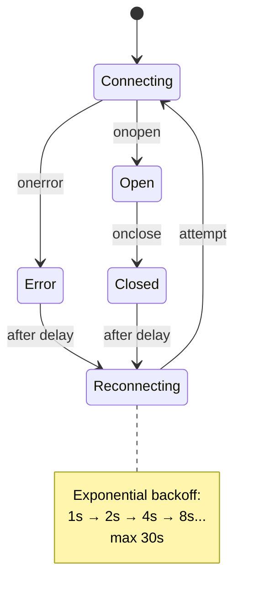

# Real-time Features: Live Updates Without Refresh

Modern apps feel alive. Chat messages appear instantly. Dashboards update in real-time. Notifications pop up without refreshing.

This chapter covers **WebSockets**, **Server-Sent Events (SSE)**, and patterns for building real-time React applications.

---

## Real-time Architecture Options

| Technology | Direction | Use Case |
|------------|-----------|----------|
| **Polling** | Client → Server | Simple, works everywhere |
| **Long Polling** | Client → Server | Better than polling |
| **SSE** | Server → Client | One-way streaming |
| **WebSockets** | Bidirectional | Full duplex communication |

---

## WebSockets: Full Duplex Communication

WebSockets maintain a persistent connection for bidirectional messaging.

### Setting Up a WebSocket Hook

```tsx
import { useState, useEffect, useRef, useCallback } from 'react';

type WebSocketStatus = 'connecting' | 'open' | 'closed' | 'error';

function useWebSocket(url: string) {
  const [status, setStatus] = useState<WebSocketStatus>('connecting');
  const [messages, setMessages] = useState<any[]>([]);
  const wsRef = useRef<WebSocket | null>(null);

  useEffect(() => {
    const ws = new WebSocket(url);
    wsRef.current = ws;

    ws.onopen = () => setStatus('open');
    ws.onclose = () => setStatus('closed');
    ws.onerror = () => setStatus('error');
    
    ws.onmessage = (event) => {
      const data = JSON.parse(event.data);
      setMessages(prev => [...prev, data]);
    };

    return () => {
      ws.close();
    };
  }, [url]);

  const send = useCallback((data: any) => {
    if (wsRef.current?.readyState === WebSocket.OPEN) {
      wsRef.current.send(JSON.stringify(data));
    }
  }, []);

  return { status, messages, send };
}
```

### Usage: Chat Application

```tsx
function ChatRoom({ roomId }) {
  const { status, messages, send } = useWebSocket(`wss://api.example.com/chat/${roomId}`);
  const [input, setInput] = useState('');

  const handleSend = () => {
    if (input.trim()) {
      send({ type: 'message', content: input });
      setInput('');
    }
  };

  return (
    <div className="chat-room">
      <div className="status">
        {status === 'open' ? '🟢 Connected' : '🔴 Disconnected'}
      </div>

      <div className="messages">
        {messages.map((msg, i) => (
          <div key={i} className="message">
            <strong>{msg.user}:</strong> {msg.content}
          </div>
        ))}
      </div>

      <input 
        value={input} 
        onChange={e => setInput(e.target.value)}
        onKeyPress={e => e.key === 'Enter' && handleSend()}
      />
      <button onClick={handleSend}>Send</button>
    </div>
  );
}
```

---

## Server-Sent Events: Simple One-Way Streaming

SSE is perfect when you only need server-to-client updates (dashboards, notifications):

```tsx
function useServerEvents(url: string) {
  const [data, setData] = useState<any>(null);
  const [error, setError] = useState<Error | null>(null);

  useEffect(() => {
    const eventSource = new EventSource(url);

    eventSource.onmessage = (event) => {
      setData(JSON.parse(event.data));
    };

    eventSource.onerror = () => {
      setError(new Error('Connection lost'));
      eventSource.close();
    };

    return () => {
      eventSource.close();
    };
  }, [url]);

  return { data, error };
}

// Usage: Live Dashboard
function StockTicker() {
  const { data: stock, error } = useServerEvents('/api/stocks/AAPL');

  if (error) return <div>Connection lost</div>;
  if (!stock) return <div>Loading...</div>;

  return (
    <div className="ticker">
      <span className="symbol">{stock.symbol}</span>
      <span className={stock.change > 0 ? 'up' : 'down'}>
        ${stock.price} ({stock.change}%)
      </span>
    </div>
  );
}
```

---

## Optimistic UI Updates

Update the UI immediately, then reconcile with the server response:

```tsx
function TodoList() {
  const [todos, setTodos] = useState<Todo[]>([]);
  const { send } = useWebSocket('wss://api.example.com/todos');

  const addTodo = (text: string) => {
    // Create optimistic todo with temp ID
    const optimisticTodo = {
      id: `temp-${Date.now()}`,
      text,
      completed: false,
      isPending: true,
    };

    // Add to UI immediately
    setTodos(prev => [...prev, optimisticTodo]);

    // Send to server
    send({ type: 'add', text });
  };

  // Handle server confirmation
  useEffect(() => {
    // When server confirms, replace temp ID with real ID
    // Handle in WebSocket onmessage handler
  }, []);

  return (
    <ul>
      {todos.map(todo => (
        <li key={todo.id} className={todo.isPending ? 'pending' : ''}>
          {todo.text}
        </li>
      ))}
    </ul>
  );
}
```

---

## Reconnection Strategy

Real-world connections drop. Implement exponential backoff:



```tsx
function useReconnectingWebSocket(url: string) {
  const [status, setStatus] = useState('connecting');
  const reconnectDelay = useRef(1000);

  useEffect(() => {
    let ws: WebSocket;
    let reconnectTimer: NodeJS.Timeout;

    function connect() {
      ws = new WebSocket(url);

      ws.onopen = () => {
        setStatus('open');
        reconnectDelay.current = 1000; // Reset delay on success
      };

      ws.onclose = () => {
        setStatus('reconnecting');
        // Exponential backoff: 1s, 2s, 4s, 8s... max 30s
        reconnectTimer = setTimeout(() => {
          reconnectDelay.current = Math.min(reconnectDelay.current * 2, 30000);
          connect();
        }, reconnectDelay.current);
      };
    }

    connect();

    return () => {
      clearTimeout(reconnectTimer);
      ws?.close();
    };
  }, [url]);

  return status;
}
```

---

## When to Use What

| Scenario | Technology |
|----------|------------|
| Chat, multiplayer games | WebSockets |
| Live dashboards, logs | SSE |
| Infrequent updates | Polling |
| Already have GraphQL | Subscriptions |

---

## Libraries to Consider

- **Socket.IO**: WebSocket abstraction with fallbacks
- **Ably / Pusher**: Managed real-time services
- **Supabase Realtime**: Built into Supabase
- **TanStack Query**: Has built-in polling and refetch-on-focus

Real-time isn't just a feature—it's an expectation.
